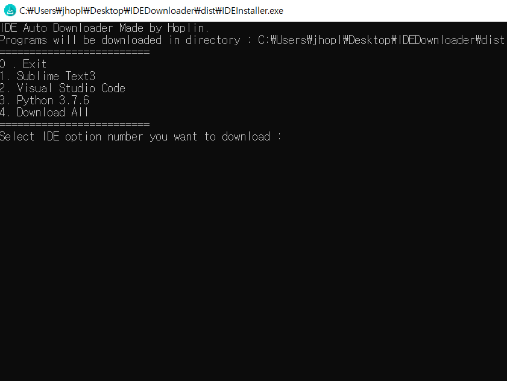
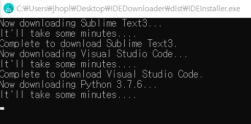
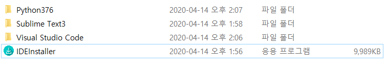

IDE Auto Downloader
===
***
**Do not use this code Commercially**

- Language : Python3

- IDE : Jetbrain Pycharm

- What for? : Download main IDEs that i'm using automatically

- Supporting IDE(I'm going to support various IDEs. Comment at issue when there is IDE you want to download with this.) : Python 3.7.6, Sublime Text3, Visual Studio Code

- exe file link : https://drive.google.com/open?id=16bwTQOdFO8KfHlXYDni5J-TlgL56Kf7w
***

1. Just enter number of IDE you want to download. If you want to exit program enter '0'

    

2. Let's make an example of i want to download all of the IDEs. When you enter option number of 'Download All', It'll start download.The download speed may vary depending on the Internet environment.

    

3. After Download IDE you want to download. Check if program is downloaded. It basically download in same directory with program.

    
